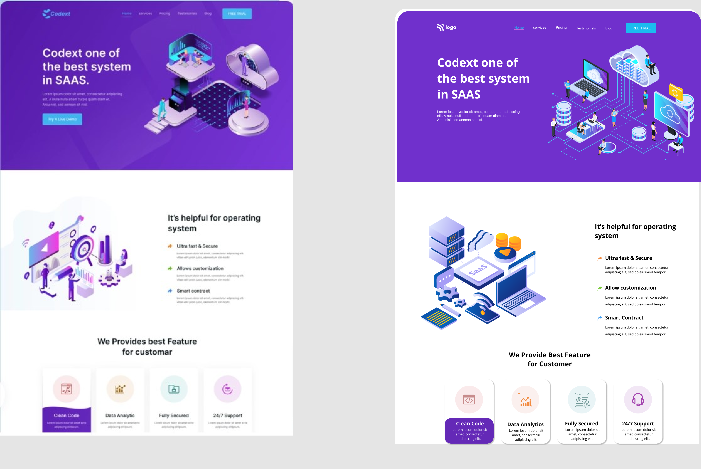

# Interior Design Landing Page

  

## [Live Preview](#) :link:

## Project Goal :dart:

To make the landing page for an imaginary business and mockup was provided. This web page is not responsive as of now.

## Skills Gained

- `filter()` property can be use to color match SVGs.
- Using `::marker` pseudo element to style list markers.

## Time Taken

```
4 Hours
```

## Intended Outcome:



> This project is part of full stack Javascript web-dev bootcamp hosted by [iNeuron.](https://ineuron.ai/)
